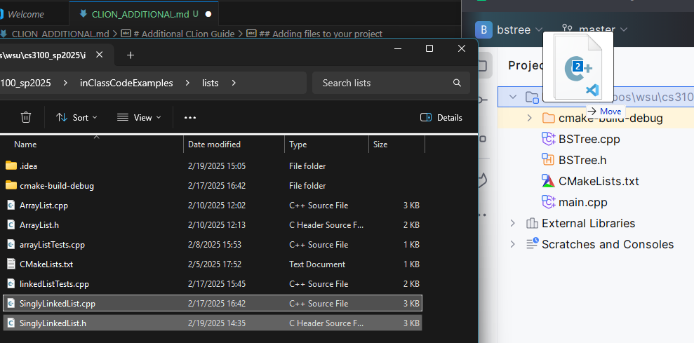
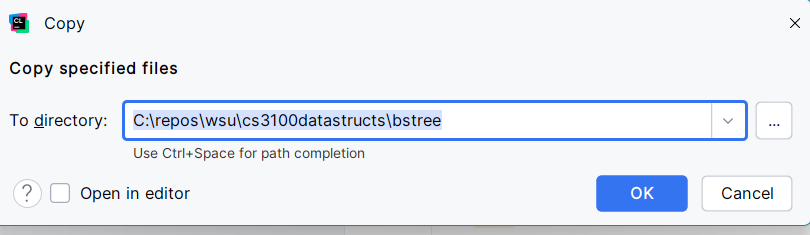
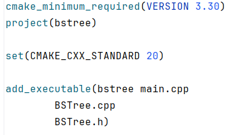
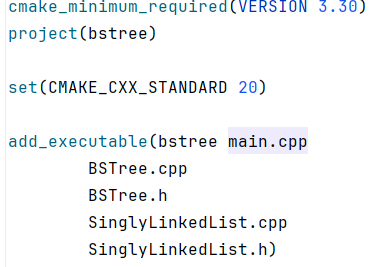

# Additional CLion Guide

## Adding files to your project
There are a few ways to add files into your project. I recommend just dragging them from your file explorer into the CLion Project pane.

If you drag them it will move the files, if you would rather copy the files into your project you can hold `CTRL` (you'll have to look up what it is for Mac) when you drag the files.  

After you drag the files, a window will pop up asking you to verify which directory you want to move or copy the files into. Make sure this is the directory with your other source files.

Once the files are moved/copied into your project folder, you now need to add them to the file `CMakeLists.txt`. This file is how CLion will know how to compile your program, including which files are required. 

Open `CMakeLists.txt` and find the statement that says `add_executable`. There should be a parameter there already for your project name, in my case is it `bstree`. There should also be the `main.cpp` file listed. If you already had any additional files, they will appear as parameters also. For my example, I already had two other files named `BSTree.cpp` and `BSTree.h`. 

 After those parameters, add the names of your files as parameters. Do not put commas between each filename. I usually put each file on a different line, but that isn't necessary. It also doesn't matter which order you put them, the only thing necessary is for the name of the executable (`bstree`) be the first parameter.

 

